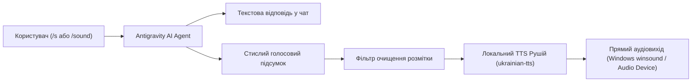

<div align="center">

# 🇺🇦 Українська озвучка Antigravity
### Ukrainian TTS Voice Plugin for Google Antigravity (AGY)

[](https://antigravity.google)
[](https://github.com/ceidj/antigravity-ukrainian-voice/releases)
[](https://python.org)
[](https://github.com/robinhad/ukrainian-tts)
[](LICENSE)
[](https://t.me/cei_DJ)

<p align="center">
  <b>Повноцінне локальне голосове озвучення для AI-асистента Antigravity природною солов'їною мовою.</b><br>
  <i>Озвучуйте резюме коду, технічні відповіді та звіти без навантаження на очі одним кліком або командою <code>/s</code>.</i>
</p>

---

</div>

## 📑 Зміст

- [📌 Огляд проєкту](#-огляд-проєкту)
- [✨ Ключові можливості](#-ключові-можливості)
- [🎯 Для кого це створено?](#-для-кого-це-створено)
- [⚙️ Як це працює](#️-як-це-працює)
- [🚀 Швидкий старт та встановлення](#-швидкий-старт-та-встановлення)
- [💡 Використання та команди](#-використання-та-команди)
- [🎙️ Доступні голоси](#️-доступні-голоси)
- [📁 Архітектура плагіна](#-архітектура-плагіна)
- [❓ Часті питання (FAQ)](#-часті-питання-faq)
- [👨‍💻 Автор та копірайти](#-автор-та-копірайти)
- [📄 Ліцензія](#-ліцензія)

---

## 📌 Огляд проєкту

**Українська озвучка Antigravity** — це відкритий плагін розширення для середовища **Google Antigravity (AGY)**, який інтегрує офлайн-рушій нейромережевого синтезу української мови безпосередньо у робочий процес розробника.

Більше не потрібно втомлювати очі довгими простирадлами тексту після безсонних ночей або багатогодинних сесій кодингу. Достатньо додати команду `/s` чи `/sound` — і Antigravity самостійно сформулює чіткий голосовий висновок та озвучить його через ваші динаміки чи навушники.

---

## ✨ Ключові можливості

- 🔘 **Графічна кнопка-бейдж у кожній відповіді**: Агент автоматично прикріплює наприкінці кожного повідомлення стильну плашку `[🔊 Озвучити відповідь]`. Достатньо просто надіслати `/s`, щоб прослухати її!
- ⚡ **Потоковий плейлист речень (Low Latency)**: Текст більше не компілюється одним великим файлом! Він автоматично розбивається на окремі речення у потокову чергу: перше речення починає лунати практично миттєво, а наступні паралельно синтезуються у фоні під час відтворення попередніх без пауз.
- 🔒 **100% Локально та в RAM (Zero Disk I/O)**: Аудіо генерується виключно в оперативній пам'яті комп'ютера без створення сміттєвих файлів на диску та без передачі даних на сторонні сервери.
- 🧹 **Розумне очищення тексту**: Вбудований фільтр автоматично прибирає з озвучки markdown-теги, блоки коду, технічні символи, хеші та URL-посилання, щоб мова звучала органічно, як жива розмова з колегою.
- 🇺🇦 **Автентичні українські голоси**: Працює на базі перевірених моделей нейросинтезу (`Dmytro`, `Tetiana`, `Lada`, `Oleksa`, `Mykyta`) зі словниковим наголошуванням.
- 🔌 **Нативна інтеграція з Antigravity**: Створено за офіційним стандартом Customization System (правила `AGENTS.md`, скіли `SKILL.md` та маніфест `plugin.json`).

---

## 🎯 Для кого це створено?

1. **Розробники після нічних спринтів**: Коли очі сльозяться від монітора після 24–48 годин без сну, а сприймати код і логіку на слух набагато легше.
2. **Паралельна робота (Multitasking)**: Запустіть складний рефакторинг або білд і слухайте резюме змін, готуючи каву чи перемикаючись між задачами.
3. **Інклюзивність та доступність (a11y)**: Допомагає розробникам з вадами зору або швидкою стомлюваністю очей комфортно взаємодіяти з AI-агентом.

---

## ⚙️ Як це працює



1. Ви надсилаєте запит разом із префіксом `/s`, `/sound` або словами *"озвуч"*, *"прочитай"*.
2. Агент створює стандартну структуровану відповідь у чаті.
3. Паралельно створюється лаконічний розмовний підсумок без коду та сміття.
4. Python-рушій синтезує хвильову форму через бібліотеку `ukrainian-tts` і миттєво відтворює звук через системний аудіодрайвер.

---

## 🚀 Швидкий старт та встановлення

### 1. Вимоги
* Встановлений **Python 3.10+**
* Встановлений пакет нейросинтезу:
```bash
pip install ukrainian-tts
```

### 2. Встановлення плагіна в Antigravity

#### Варіант А: Глобально для всіх проєктів на вашому ПК (Рекомендовано)
Склонуйте репозиторій у глобальну папку плагінів Antigravity:

```bash
git clone https://github.com/ceidj/antigravity-ukrainian-voice.git ~/.gemini/config/plugins/ukrainian-voice
```

#### Варіант Б: Для конкретного проєкту
Склонуйте репозиторій у робочий простір:

```bash
git clone https://github.com/ceidj/antigravity-ukrainian-voice.git .agents/plugins/ukrainian-voice
```

Після клонування плагін підхоплюється автоматично без необхідності перезапуску!

---

## 💡 Використання та команди

Плагін автоматично активується, якщо у вашому запиті присутній будь-який із маркерів:

| Команда / Тригер | Приклад запиту | Що станеться |
| :--- | :--- | :--- |
| `/s` | `/s у чому тут помилка?` | Агент знайде помилку в коді, напише пояснення в чат та **озвучить головну причину голосом**. |
| `/sound` | `/sound поясни архітектуру проєкту` | Надасть структурований опис і **прочитає підсумок уголос**. |
| `/S sound` | `/S sound` | Озвучить попереднє повідомлення або статус задачі. |
| Природні слова | *"озвуч це"*, *"прочитай уголос"* | Агент згенерує аудіоверсію відповіді. |

---

## 🎙️ Доступні голоси

За замовчуванням встановлено чоловічий голос **`dmytro`**. У файлі `speak_ukr.py` можна обрати будь-який інший голос української моделі:

* `dmytro` — впевнений, глибокий чоловічий голос *(за замовчуванням)*
* `tetiana` — м'який, чіткий жіночий голос
* `lada` — спокійний жіночий тембр
* `mykyta` — динамічний чоловічий тембр
* `oleksa` — класичний дикторський голос

---

## 📁 Архітектура плагіна

```text
ukrainian-voice/
├── plugin.json                 # Офіційний маніфест плагіна Antigravity
├── README.md                   # Повна документація та інструкція
├── requirements.txt            # Залежності Python
├── .gitignore                  # Ігнорування кешу та тимчасових аудіофайлів
├── rules/
│   └── AGENTS.md               # Завжди активні інструкції для AI агента
└── skills/
    └── sound/
        ├── SKILL.md            # Визначення прогресивного скіла
        └── scripts/
            └── speak_ukr.py    # Автономний оптимізований скрипт генерації аудіо
```

---

## ❓ Часті питання (FAQ)

<details>
<summary><b>Чи потрібен інтернет для генерації голосу?</b></summary>
Ні. Модель та словники завантажуються лише один раз під час першого запуску, після чого весь синтез відбувається на 100% офлайн на вашому процесорі чи відеокарті.
</details>

<details>
<summary><b>Чому я не чую читання технічних символів або лапок?</b></summary>
У плагін вбудовано спеціальний фільтр нормалізації тексту, який очищає markdown-символи (<code>```</code>, <code>*</code>, <code>#</code>, <code>_</code>), посилання та службові символи, перетворюючи текст на живу літературну мову.
</details>

<details>
<summary><b>Чи працює плагін на Linux та macOS?</b></summary>
Так! Базовий скрипт використовує стандартний Python. На Windows використовується <code>winsound</code>, а для macOS/Linux можна викликати системні утиліти <code>afplay</code> або <code>aplay</code>.
</details>

---

## 👨‍💻 Автор та копірайти

* **Автор проєкту:** [ceidj (Cei DJ)](https://github.com/ceidj)
* **Telegram:** [@cei_DJ](https://t.me/cei_DJ)
* **GitHub Репозиторій:** [https://github.com/ceidj/antigravity-ukrainian-voice](https://github.com/ceidj/antigravity-ukrainian-voice)

Будь-які ідеї, пул-реквести та зірочки на GitHub щиро вітаються! ⭐️

---

## 📄 Ліцензія

Цей проєкт поширюється під відкритою ліцензією [MIT](LICENSE). Ви можете вільно використовувати, змінювати та інтегрувати його у власні рішення.
